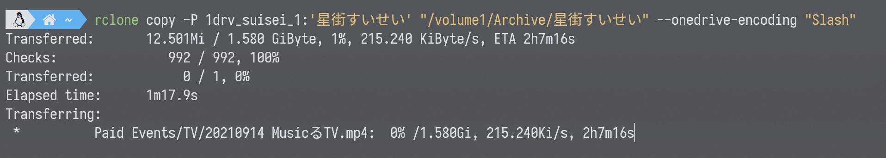

# Storage

[[toc]]

## rclone

[ [rclone](https://rclone.org/) ]

rclone is nearly the best universal way to copy / sync the files among your local and the cloud drives.

### Target Site

- OneDrive
- Google Drive
- Amazon S3
- Backblaze
- ...
- etc.

### Installation

#### Windows

Read [Windows Preparation](/docs/preparation/windows.md). Then download `rclone.exe` from [Download Page](https://rclone.org/downloads/) and put it in your `$PATH` folder.

#### Ubuntu

`rclone` can be installed by using a script

```bash
curl https://rclone.org/install.sh | sudo bash
```

### Configuration

The configuration part is extremely complicated so I won't write it here, just follow the official guide listed below

- For OneDirve click [HERE](https://rclone.org/onedrive/)
- For Google Drive clike [HERE](https://rclone.org/drive/)

### Usage

Once you are done with the configuration, you can start uploading to or downloading from the remote.

I will take OneDrive as the example since it has some special config to do.

For download

```bash
rclone copy -P "<remote drive>":"<remote folder>" "<local folder>"
```

For upload

```bash
rclone copy -P "<local foler>" "<remote drive>":"<remote folder>"
```



`copy`: Copy mode will check the files first before downloading, skipping all files that is identically the same.

`-P`: Show progress when transferring, without the flag rclone will run with no info shown.

::: tip

You can add `--onedrive-encoding "Slash"`, which is special flag that let the rclone only converts filenames with `/` in it.

It is important so it won't mess with `#`.

:::
