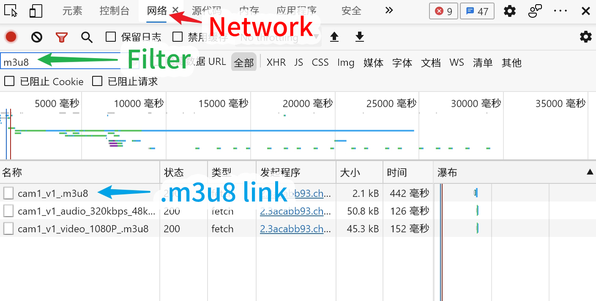
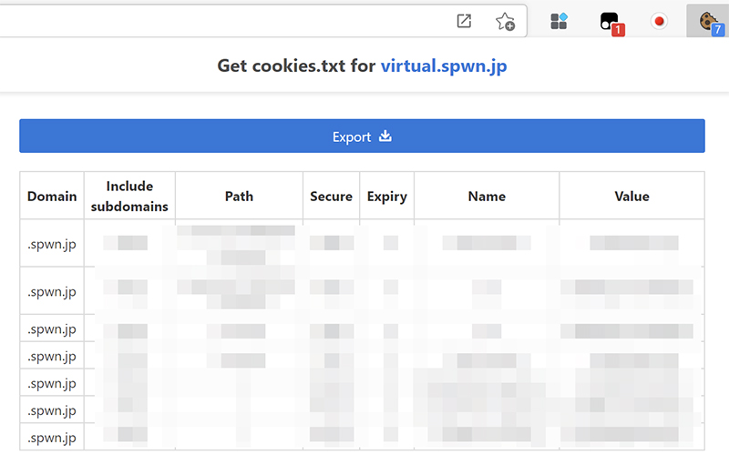
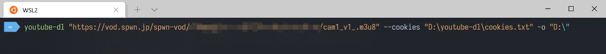
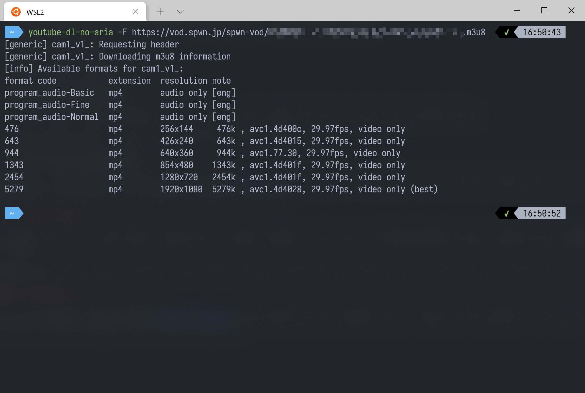

# General .m3u8 stream

There are a lot of sites that are not officially supported by youtube-dl / yt-dlp, but with an `m3u8` link can still be downloaded.

## Target Site

- SPWN
- Nissin
- ...
- etc.

## Link Extraction



After entering the streaming page, press F12 on your keyboard to bring up the developer console for your browser. Click on the "Network" tab on the top (the <span style="color:#e93320;font-weight:bold">RED</span> arrow).

In the "Filter URLs" section, type in `m3u8`, then **refresh the page**. You should see the main `.m3u8` link generated (the <span style="color:#59ac59;font-weight:bold">GREEN</span> arrow).

If the default resolution isn't 1080p don't worry, keep the developer console open and select 1080p manually and you should be able to see the main `.m3u8` link generate.

Right click the .m3u8 link (the <span style="color:#43a2e3;font-weight:bold">BLUE</span> arrow), and select Copy > Copy URL. **This is the URL to the actual video source, so make sure you write it down somewhere**

::: warning
Make sure the actual extracted link looks like cam_v1_.m3u8, or it might not contain audio.
:::

## Grab cookies.txt



Make sure you have the `Get cookies.txt` extension installed on your browser (link above). Now click on the plugin icon, and click `Export` . You can save the `cookies.txt` file anywhere you like.

## Download

Now that you have the `.m3u8` link and the `cookies.txt`, we are ready to use `youtube-dl` to download the video. 

Use this template to download the video. Replace the stuff in `""` with the appropriate content you got from earlier

```bash
youtube-dl "the .m3u8 link" --cookies "path to cookies.txt" -o "path to where you want to save the video"
```

Your command should look something like this



Now press enter and the download should start. Wait a bit and you should see the video in the path you specified above.

## Format Selection

The naming rule of SPWN's .m3u8 video and audio is different compared to YouTube, so the `best` or `bestaudio+bestvideo` option doesn't always work with SPWN and other sites.

Use `-F` to make sure the format we are going to download first.



As shown above, there are different formats available.

Since we are going to archive the best format so what we need is `5279` (best) and `program_audio-Fine`.

Then type

```bash
youtube-dl -f 5279+program_audio-Fine ".m3u8 address"
```

We shall have the best video and audio downloaded.
