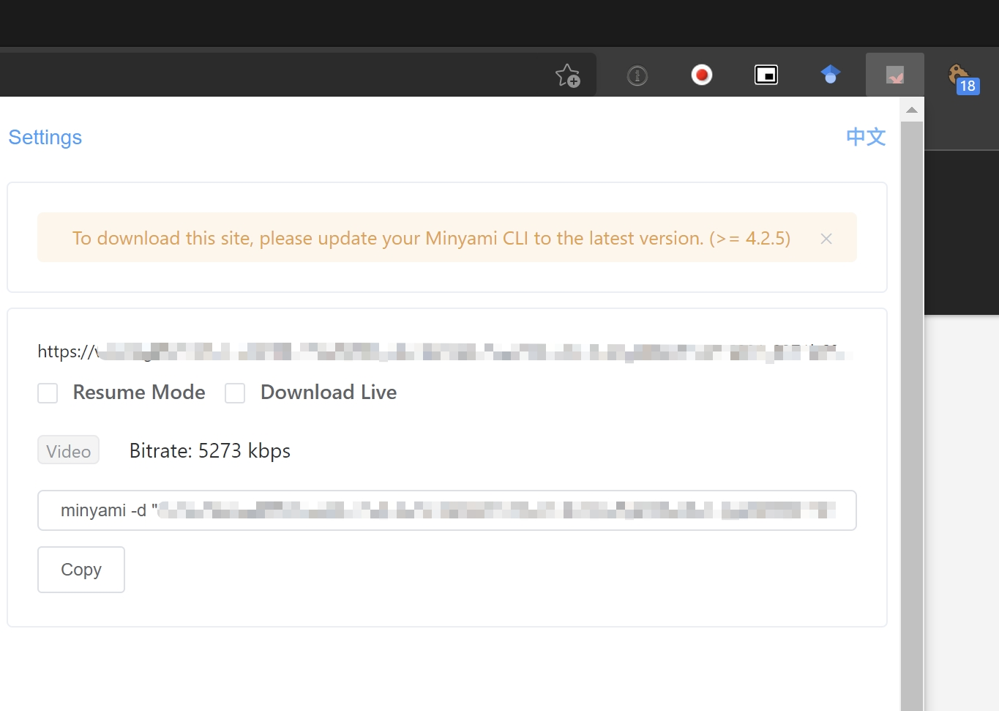

# minyami

[ [minyami](https://github.com/Last-Order/Minyami) ]

This is a tool mainly focued on nicolive timeshift ( stream archive ) and AbemaTV downloading.

## Target Site 

- Nico Live ( timeshift only )
- AbemaTV

## Installation

### Windows

Check [Node.js official site](https://nodejs.org/) and download the `LTS` version.

To check if installation is successful, type `npm version` to see if it returns value.

### Ubuntu

See [Preparations](/docs/preparation/ubuntu?id=nodejs) to install `npm` and `node.js` environment.

Once done with installation, install by `npm`

```bash
npm i -g minyami
```

### Plugin

`minyami` requires a Chrome extension to extract the replay keys and other values to download.

Chrome extension Link [Here](https://chrome.google.com/webstore/detail/minyami/cgejkofhdaffiifhcohjdbbheldkiaed) .

## Usage

Open a nicolive timeshift link and click the plugin to extract the command you will need for download.



Click *Copy* and paste it in your CLI to start download.

It also applies to AbemaTV.

## Caution

- Premium subscription is optional, which will ensure you can extract the highest quality video during busy hours.

- Channel subscription is optional, which will grant you the full access to the stream.

- Japan IP is optional, but some programs are not available outside Japan (especially streams with anime playing).

- There are reports saying Niconico banned some IPs because of abuse, if you find that `minyami` cannot download, please try another IP.

If you have any questions, please read the `README.md` in the original repos.
