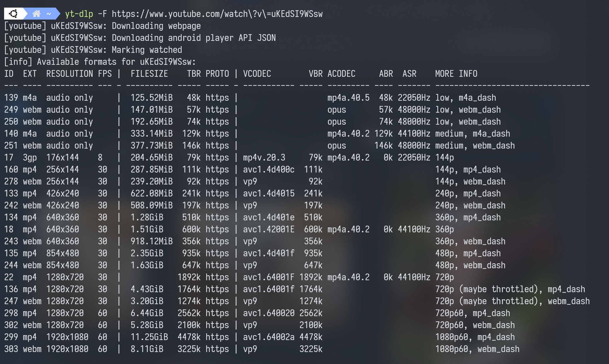

# youtube-dl / yt-dlp

[ [youtube-dl](https://github.com/ytdl-org/youtube-dl) ] [ [yt-dlp](https://github.com/yt-dlp/yt-dlp) ]

This will be the primary tool to download youtube-dl videos, as well as the generic `.m3u8`.

If you are using `yt-dlp` (and I recommend using it most of the time), just replace all `youtube-dl` with `yt-dlp` .

The workflow of youtube-dl / yt-dlp:

> Downloaded video and audio → Merged .mp4 file → Write metadata → Write thumbnail

## Target Site

- YouTube
- TVer
- SPWN
- ...
- Any sites on the support list
- Any sites using non-encrypted `.m3u8` stream

## Installation

### Windows

Read [Windows Preparation](/docs/preparation/windows.md). Then download `youtube-dl.exe` from [release](https://github.com/ytdl-org/youtube-dl/releases/) and put it in your `$PATH` folder.

### Ubuntu / Linux

Install `python` and the required packages first.

```bash
sudo apt update && sudo upgrade -y
sudo apt install python3 python3-pip python-is-python3 ffmpeg atomicparsley
```

There are 2 ways to install 

- Install using `curl`

```bash
sudo curl -L https://yt-dl.org/downloads/latest/youtube-dl -o /usr/local/bin/
sudo chmod a+rx /usr/local/bin/youtube-dl
```

- Install using `pip3`

```bash
sudo -H pip install --upgrade youtube-dl
```

If you are using `yt-dlp` (and I suggest using it for most of the time), just replace all `youtube-dl` with `yt-dlp`.

## Usage

To start the download

```bash
youtube-dl "url"
```

### Configuration

You will need to do further configuration to download a better quality file or for membership-only archives.

For Windows, the config files is located at `%APPDATA%\youtube-dl\config.txt` or `C:\Users\<user name>\youtube-dl.conf`.

```bash
-o 'D:\YouTube\(upload_date)s %(title)s.%(ext)s' # replace the directory
--embed-thumbnail
--format 'bestvideo+bestaudio/best/mp4'
--merge-output-format mp4
--add-metadata
--cookies '/home/ubuntu/cookies.txt' # replace the directory
```

For Ubuntu, the config file is located at `/etc/youtube-dl.conf`.

```bash
-o '/home/ubuntu/raw/(upload_date)s %(title)s.%(ext)s' # replace the directory
--embed-thumbnail
--format 'bestvideo+bestaudio/best/mp4'
--merge-output-format mp4
--add-metadata
--cookies '/home/ubuntu/cookies.txt' # replace the directory
```

Adding `--cookies cookies.txt` option helps downloading the member-only contents.

:::tip

You can also use `--format (bestvideo[vcodec=vp9]/bestvideo)+(bestaudio[acodec=opus]/bestaudio)bestvideo+bestaudio/best/mp4` to prefer `vp9` + `opus` while also enable other formats as a fallback.

:::

Use this plugin to get a `cookies.txt` : [ [Chrome](https://chrome.google.com/webstore/detail/get-cookiestxt/bgaddhkoddajcdgocldbbfleckgcbcid) ] [ [Firefox](https://addons.mozilla.org/en-US/firefox/addon/cookies-txt/) ]

### Manual Quality Select

You can manually check and select the quality or specify video / sound to download.

To check the available quality use `-F`

```bash
youtube-dl -F "link"
```

It will return a list like this



To download the specific quality use `-f "video"+"audio"`

```bash
youtube-dl -f 303+251 "link"
```

### General .m3u8 streams

The usage is basically the same but it will require some steps to extract the link.

Link extraction will be introduced [HERE](/docs/download/m3u8.md)
