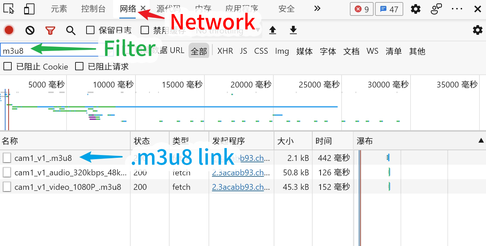
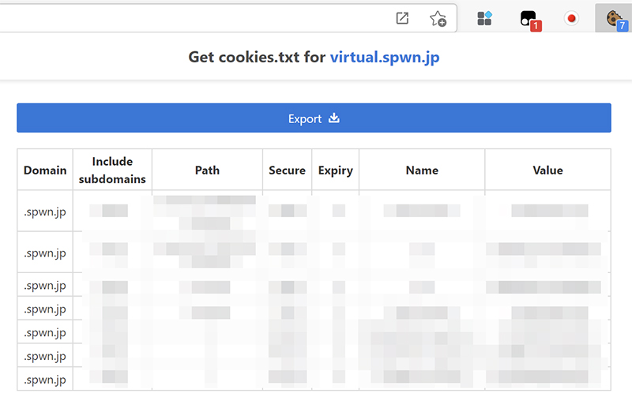
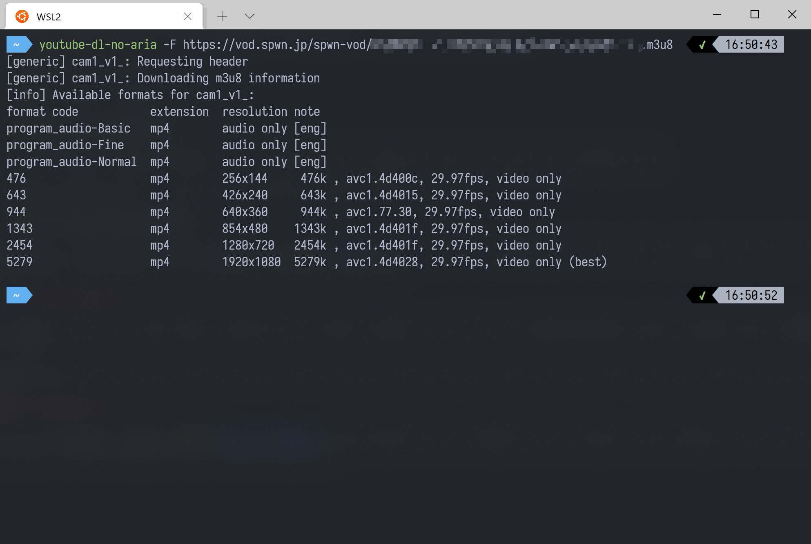

# 通用 .m3u8

儘管很多網站沒有被 youtube-dl / yt-dlp 正式支持，但實際上只要有直播串流的 `.m3u8` 連結即可下載。

## 適用網站

- SPWN
- Nissin
- ...
- etc.

## 獲取連結



打開直播頁面，點擊 F12 打開瀏覽器的開發模式。隨後點擊<span style="color:#e93320; font-weight:bold">紅色</span>箭頭指向的 網路 頁籤。

在<span style="color:#59ac59; font-weight:bold">綠色</span>箭頭指向的 過濾器 中輸入 m3u8 ，隨後**刷新一次頁面**。

此時應該可以看到一些 m3u8 連結被篩選出来了。

因為每個人的網路環境不同，默認串流品質不盡相同。為了確保可以獲取最高畫質，我們提取 main m3u8 index 以獲取所有串流品質選項。

右鍵點擊<span style="color:#43a2e3; font-weight:bold">藍色</span>剪頭指向的條目，選擇複製 > 複製URL。

::: warning 建議

確保您獲取的是 index 而非某一特定品質的串流連結。有時這些特定品質的連結不包含音頻流。

:::

## 獲取 cookies.txt



由於 SPWN 等網站提供的是付費節目，需要對用戶進行鑒定權限。因此需要獲取 `cookies.txt` 已通過驗證。

此處用到的是 `Get cookies.txt` 插件 [ [Chrome](https://chrome.google.com/webstore/detail/get-cookiestxt/bgaddhkoddajcdgocldbbfleckgcbcid) ] [ [Firefox](https://addons.mozilla.org/en-US/firefox/addon/cookies-txt/) ]

安裝插件後，確保您已登陸網站，並點擊插件圖標。在彈出對話框中選擇 Export ，瀏覽器會自動保存 `cookies.txt` 至本機。

## 下載

此處已經獲取 `.m3u8` 連結以及 `cookies.txt` ， 可以使用 youtube-dl / yt-dlp 下載影片了。

下載指令如下，將引號內容換成對應訊息。

Use this template to download the video. Replace the stuff in `""` with the appropriate content you got from earlier

```bash
youtube-dl ".m3u8 link" --cookies "path to cookies.txt" -o "local saving path"
```


現在可以開始下載了。

## 手動選擇品質

由於 SPWN 等網站的串流命名不規範，所以僅使用 `best` 或 `bestaudio+bestvideo` 並不能很好確保拉取到最佳品質的串流。

建議在下載前添加 `-F` 選項以檢查可獲取的編碼格式 / 品質。



同上所示，添加 `-F` 後程序列出了可選的所有格式。

此處輸入 `-f 5279+program_audio-Fine` 以拉取最高品質的視頻及音頻串流。

```bash
youtube-dl -f 5279+program_audio-Fine ".m3u8 address"
```

現在我們可以下載最高品質的影片了。
