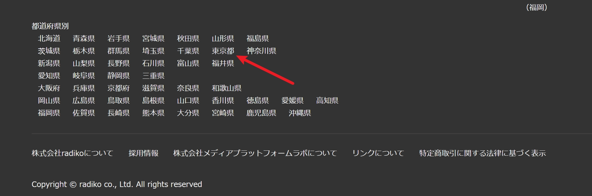

# radigo

[ [radigo](https://github.com/yyoshiki41/radigo) ]

本項目僅用於抓取 [radiko.jp](https://radiko.jp) 的電台存檔。

## 適用網站

- Radiko.jp

## 安裝

### Windows

閱讀 [Windows 環境準備](/docs/preparation/windows.md) ，並從[官方源](https://github.com/yyoshiki41/radigo/releases/)下載 `radigo.exe` 並把它放入 `$PATH` 文件夾。

### Ubuntu

從[官方源](https://github.com/yyoshiki41/radigo/releases/)下載對應版本並執行如下命令

```bash
mv /usr/local/bin/radigo
sudo chmod a+rx /usr/local/bin/radigo
```

輸入 `radigo` 來驗證是否成功。

## 使用

### 常規節目

radiko 會根據 IP 所在地決定可看的電台節目。

基本下載命令如下

```bash
radigo rec -a="area ID" -id="program ID" -s="timestamp"
```

`area ID` 可以從頁面底部找到。



點開後可以發現類似這樣的連結，如 `JP13` 是東京的 `area ID` 。

```bash
https://radiko.jp/index/JP13
```

`program ID` 和 `timestamp` 則是從對應存檔的連結中找到。

```
https://radiko.jp/#!/ts/QRR/20210914175500
```

`program ID` = QRR

`timestamp` = 20210914175500

### 高級訂閱

部分節目歸屬於其他地區， radiko 要求使用者訂閱高級帳號，才能收聽這些區域外電台的存檔。

第一步．註冊並通過信用卡支付高級訂閱費用。

如果您在使用 Ubuntu ，那麼請執行如下指令：

```bash
export RADIKO_MAIL="radigo@example.com" && export RADIKO_PASSWORD="password"
radigo rec -a="area ID" -id="program ID" -s="timestamp"
```

您也可以將登錄訊息輸入 `~/.zshrc` 或 `~/.bashrc` 。

## 注意

Radiko 僅對日本服務，您至少需要一个日本 IP 来獲取下載所需的相關信息。

您的 IP 所在地會影響您可以收聽 / 下載的内容。例如：我的伺服器 IP 被規劃至東京，那麼我的伺服器在沒有高級訂閱的情况下，僅可接收到默認分配给東京的節目。
