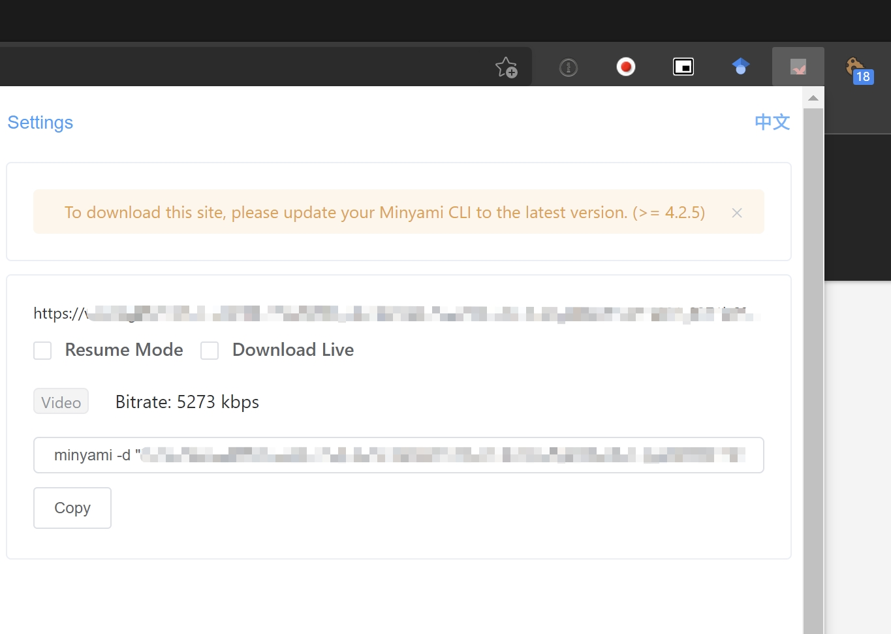

# minyami

[ [minyami](https://github.com/Last-Order/Minyami) ]

本工具主要用于 Niconico Timeshift （直播存档），以及 AbemaTV 影片的下载。

## 适用站点 

- Nico 直播 ( 仅直播部分 )
- AbemaTV

## 安装

### Windows

打开 [Node.js 官方网站](https://nodejs.org/) 并下载 `LTS` 版本。

输入 `npm version` 检查是否安装成功。

### Ubuntu

阅读 [Ubuntu 环境准备](/docs/preparation/ubuntu?id=nodejs) 一节，安装 `npm` 以及 Node.js 。

安装成功后，输入以下命令安装 `minyami`

```bash
npm i -g minyami
```

### 浏览器插件

`minyami` 需要配合浏览器插件生成下载所需要的命令。

Chrome 插件点击 [这里](https://chrome.google.com/webstore/detail/minyami/cgejkofhdaffiifhcohjdbbheldkiaed) 进行下载及安装。

## 使用

首先打开一个 Nico 直播的存档页面，随后点击插件，插件会自动生成下载所需的命令。



点击复制，将命令粘贴并执行，即可开始下载。

AbemaTV 页面下载流程相同，不再赘述。

## 注意

要顺利下载 Nico 直播存档，你可能需要准备这些

- 高级会员（可选），这样在 Niconico 的繁忙时段也可以下载最高画质的影片。

- 频道会员（可选），部分直播需要频道会员订阅才可以观看（完整）存档。

- 日本 IP（可选），部分节目锁区，仅供日本用户观赏，尤其是动画的上映会等。

有报告称 Niconico 屏蔽了部分机房 IP 地址。如果发现 `minyami` 持续报错，请尝试更换 IP 后再尝试

如果有其他使用上的疑问，请阅读 Github 上的 `README.md` 获取更多信息。
